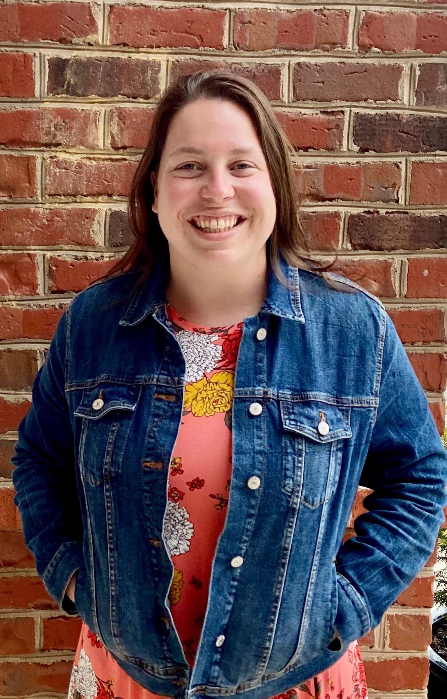

```{r setup, include=FALSE}
knitr::opts_chunk$set(echo = FALSE)
```
{width=25%} 

I am currently a third year doctoral student in the Special Education and Disability Policy program at Virginia Commonwealth University. For my dissertation, I am interested in investigating barriers and supports to healthcare access for children with disabilities. 

I enjoy completing program evaluations to help school districts and organizations determine participant satisfaction, knowledge gained, and ideas for improvement. During the past two summers, I worked for the Metropolitan Educational Research Consortium (MERC) to complete a program evaluation of the Petersburg Partnership Program. 

I plan to complete my PhD in Spring/Summer of 2023 and begin my career as a data analyst. 

